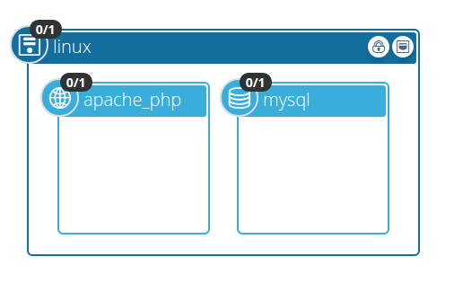

LAMP
====

This blueprint installs the LAMP (Linux, Apache, MySQL, PHP) stack on an Ubuntu VM in an Openstack environment.

The topology is described in the following diagram:



### Plugins

The blueprint makes use of two plugins:

- [Openstack Plugin](https://github.com/cloudify-cosmo/cloudify-openstack-plugin)

This plugin is, as the name suggests, responsible for creating the needed infrastructure components.
In this blueprint we are creating one VM, one floating IP and one security group.

- [Fabric Plugin](https://github.com/cloudify-cosmo/cloudify-fabric-plugin)

Usually, when you want to execute commands on the agent host, you just use the [Script Plugin](https://github.com/cloudify-cosmo/cloudify-script-plugin).
However, this requires a Cloudify Agent to be installed on the host and accept these commands.
Sometimes, we don't want this agent installed but still want to execute some commands. This is where this plugin becomes handy.
It lets you execute various [Fabric](http://www.fabfile.org/) tasks with an easy to use API.
In our case, we map each lifecycle operation to a different *Fabric* task, thus making the entire installation process *agent-less*.

### Resources

The blueprint comes with a *php* file located [here](/resources/info.php).
This file will be copied to */var/www/* on the host machine, and will be evaluated and displayed when you hit the endpoint.

### Tasks

All fabric tasks are located [here](/tasks). Note that tasks do not have to be decorated with the ```@task``` decorator.

## Contributing

There is still much that can be done to improve this blueprint.

For example:

 1. Make it work on a distribution other than Ubuntu.
 2. Try removing the *sudo* requirement.
 3. Make the apache port configurable (currently 80)

if you are up for it, we will be more than happy to accept contributions in the form of Pull Requests :)
